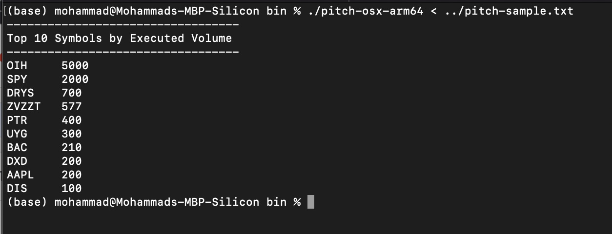

# Pitch

# Run:
`````
$ cd bin
$ ./pitch-osx-amd64 < ../pitch-sample.txt 
`````
<div align="center">
  <a href="https://github.com/othneildrew/Best-README-Template">
    
  </a>
</div>


# Compile:

Download and install Go compiler from https://go.dev and then run this command:
`````
$ go build main.go
`````
For ease of running the program, I have built binaries for OSX, Linux and Windows operating systems and placed them in the bin folder.